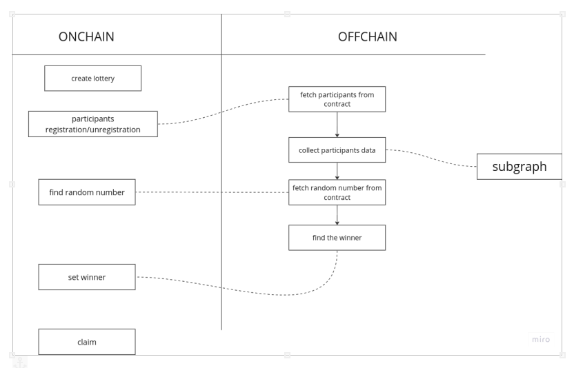
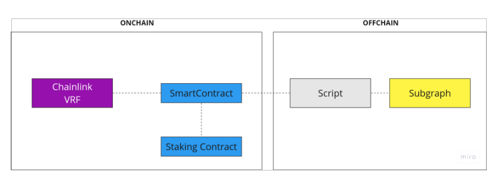

# Prottery

Prottery is a dapp created by Protofire that allows you to earn more GRTs playing the lottery using The Graph. 

## How it works?

1. An Admin creates the lottery by setting both the start and end time. Also depositing the prize in GRT.

2. Once the lottery is live, a delegator can enter the lottery

3. An admin can start the raffle process when the lottery duration has ended. We calculate the winning changes for each participant proportional to the amount of stake they have provided. A random number is generated (Using chainlink) and the prize (GRT) is unlocked for the winner.

4. Once the raffle process has ended, the winner can claim his prize.

## How can I participate? 

There are only two requirements: 

* Have delegated to our indexer. 
* Have enrolled for the lottery.

So if you want to participate, please follow the next steps:

1. Delegate some GRTs tokens using Arbitrum network in Protofire Indexer. (You also need a few amount of eth to pay transactions)

	[Delegate GRTs on Protofire Indexer](https://thegraph.com/explorer/profile/0x0fd8fd1dc8162148cb9413062fe6c6b144335dbf?view=Indexing&chain=arbitrum-one)

2. Enroll to play the lottery connecting your wallet 

	[Register in Prottery](https://prottery.protofire-thegraph.com)

## Technical Details

Part of this app runs offchain and another onchain. In the following diagram we can see more details of its operation.

Chainlink generates the seed which is the random number necessary to choose the winner

### Smart Contracts

* proxy: [0x02D1F0D6F0Bb52EEBEDAC461c3703678438ae5D5](https://arbiscan.io/address/0x02D1F0D6F0Bb52EEBEDAC461c3703678438ae5D5)
* jackpot: [0xE5C9dbACF62aA1cA7AE85a17123917f3718Fd8Ab](https://arbiscan.io/address/0xE5C9dbACF62aA1cA7AE85a17123917f3718Fd8Ab)
* impl: [0xB53Cd38a65f565d1c23b1257760C283d9CAAC803](https://arbiscan.io/address/0xB53Cd38a65f565d1c23b1257760C283d9CAAC803)

